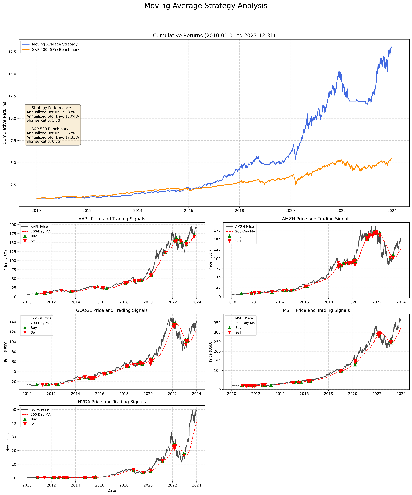

# Moving Average Trading Strategy: Backtester & IBKR Bot

This project provides a framework for backtesting and deploying a quantitative trading strategy based on a simple moving average (SMA). It consists of two main components:

1.  A **backtesting script** (`backtester.py`) that uses historical data from Yahoo Finance to evaluate the strategy's performance against the S&P 500.
2.  A **live trading bot** (`trading_bot.py`) that connects to the Interactive Brokers (IBKR) API to execute trades.

## The Strategy

The logic is based on a trend-following strategy that uses a 200-day moving average to generate signals.

-   **Buy/Hold Signal**: A position is initiated or held if the stock's last closing price is **above** its 200-day moving average.
-   **Sell/Exit Signal**: Any existing position is sold if the stock's last closing price falls **below** its 200-day moving average.

The portfolio is **equally weighted**. For the stocks in the list, the strategy allocates an equal portion of the portfolio to each stock that meets the "Buy/Hold" criteria. If a stock does not meet the criteria, its allocation is held as cash.

## Project Components

### 1. `backtester.py`

This script evaluates the strategy's historical performance.

-   **Data Source**: Downloads daily stock prices from Yahoo Finance (`yfinance`).
-   **Functionality**:
    -   Compares the strategy's performance against the **S&P 500 (SPY)** benchmark.
    -   Calculates and prints performance metrics, including **Annualized Return**, **Standard Deviation**, and **Sharpe Ratio**.
    -   The chart visualizes cumulative returns and plots the price, 100/200-day MA, and buy/sell signals for each stock in the portfolio.

### 2. `trading_bot.py`

This script connects to the Interactive Brokers API to execute trades.

-   **Framework**: Uses the official Interactive Brokers Python API (`ibapi`).
-   **Functionality**:
    -   Connects to an instance of Trader Workstation (TWS) or IB Gateway.
    -   Operates on an event-driven model to request historical data and determine trading signals.
    -   Places Market Orders (`MKT`) to buy stocks that are above their SMA and sell owned stocks that have fallen below it.

## Output Example

Running `backtester.py` will generate and save a detailed analysis chart like the one below, providing a complete overview of the strategy's performance and behavior.

